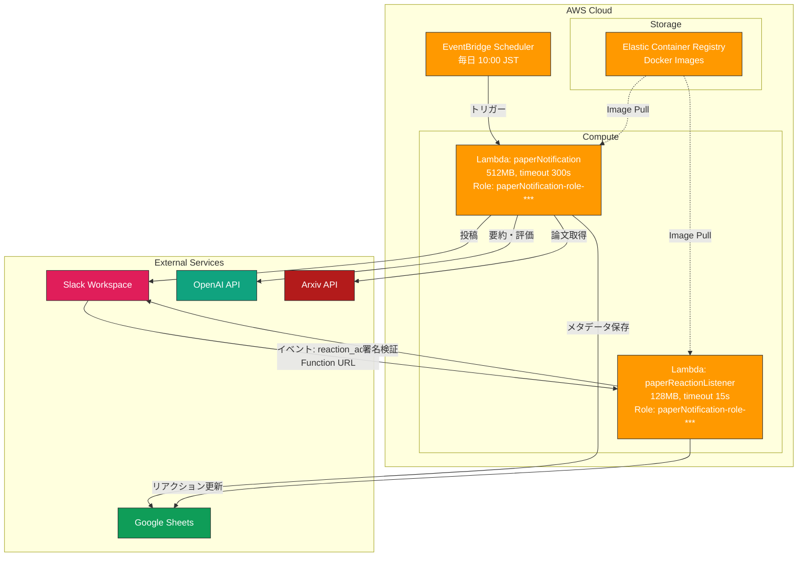

# システムアーキテクチャ

> [!WARNING]
> 本ドキュメントの記載内容は、2026-01-26時点のAWS設定(CLI)に基づいて更新されました。

## 概要
本日開発した **Arxiv Paper to Slack** システムは、主に通知用（Notifier）とリアクション同期用（Listener）の2つのAWS Lambda関数で構成されています。

## アーキテクチャ図

## コンポーネント詳細

### 1. `paperNotification` (Notifier)
*   **トリガー**: EventBridge スケジュール (`cron(0 1 * * ? *)` - UTC 01:00 / JST 10:00)
*   **ランタイム**: Python 3.9 (Container Image)
*   **役割**:
    *   クエリに基づいてArxivから新規論文を取得
    *   Google Sheetsを参照して重複を除外
    *   OpenAIを使用して要約と重要度判定を実施
    *   Slackへ整形されたブロックメッセージを投稿
    *   論文情報をGoogle Sheetsへ保存
*   **主要な環境変数**: `SLACK_API_TOKEN`, `OPENAI_API_KEY`, `SPREADSHEET_ID`

### 2. `paperReactionListener` (Listener)
*   **トリガー**: Lambda Function URL (Public, Auth: NONE - コード内で署名検証)
*   **ランタイム**: Python 3.9 (Container Image)
*   **役割**:
    *   Slack Event SubscriptionからのHTTP POSTを受信
    *   リクエスト署名 (`x-slack-signature`) を検証
    *   `reaction_added` イベントを解析
    *   SlackのタイムスタンプをキーにGoogle Sheetsの該当行を特定
    *   "Reactions" カラムに対応する絵文字を追記
*   **主要な環境変数**: `SLACK_SIGNING_SECRET`, `SPREADSHEET_ID`

## インフラ管理
*   **現状**: 手動管理 (AWS Management Console)
*   **今後**: IaC (Terraform/CDK) への移行を計画中 (参照: Issue #20)
