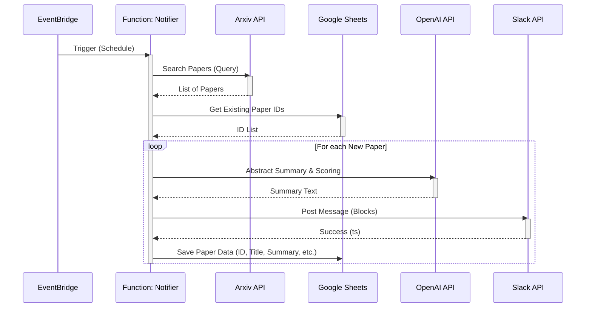
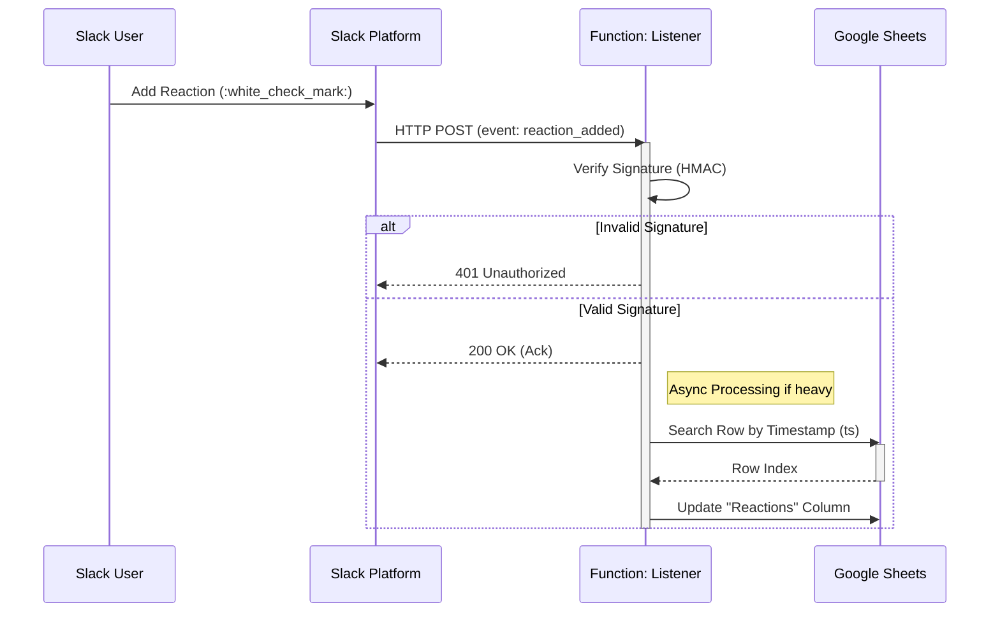

# システムアーキテクチャ


> [!WARNING]
> 本ドキュメントの記載内容は、2026-01-26時点のAWS設定(CLI)に基づいて更新されました。

## 概要
本日開発した **Arxiv Paper to Slack** システムは、主に通知用（Notifier）とリアクション同期用（Listener）の2つのAWS Lambda関数で構成されています。

## アーキテクチャ図


## コンポーネント詳細

### 1. `paperNotification` (Notifier)
*   **トリガー**: EventBridge スケジュール (`cron(0 1 * * ? *)` - UTC 01:00 / JST 10:00)
*   **ランタイム**: Python 3.12 (Container Image)
*   **役割**:
    *   クエリに基づいてArxivから新規論文を取得
    *   Google Sheetsを参照して重複を除外
    *   OpenAIを使用して要約と重要度判定を実施
    *   Slackへ整形されたブロックメッセージを投稿
    *   論文情報をGoogle Sheetsへ保存
*   **主要な環境変数**: `SLACK_API_TOKEN`, `OPENAI_API_KEY`, `SPREADSHEET_ID`

### 2. `paperReactionListener` (Listener)
*   **トリガー**: Lambda Function URL (Public, Auth: NONE - コード内で署名検証)
*   **ランタイム**: Python 3.12 (Container Image)
*   **役割**:
    *   Slack Event SubscriptionからのHTTP POSTを受信
    *   リクエスト署名 (`x-slack-signature`) を検証
    *   `reaction_added` イベントを解析
    *   SlackのタイムスタンプをキーにGoogle Sheetsの該当行を特定
    *   "Reactions" カラムに対応する絵文字を追記
*   **主要な環境変数**: `SLACK_SIGNING_SECRET`, `SPREADSHEET_ID`

## プロジェクト構造 (Mono-Repo)

本リポジトリはMono-Repo構成を採用しており、各サービスとインフラコードが統合されています。

```
.
├── services/
│   ├── notifier/        # 通知用Lambda (paperNotification)
│   │   ├── src/         # ソースコード
│   │   ├── tests/       # ユニットテスト
│   │   └── Dockerfile
│   └── listener/        # リアクション同期用Lambda (paperReactionListener)
│       ├── src/         # ソースコード
│       ├── tests/       # ユニットテスト
│       └── Dockerfile
├── infra/               # インフラストラクチャ定義 (AWS CDK - TypeScript)
├── .github/workflows/   # CI/CD パイプライン定義
└── docs/                # ドキュメント
```

## シーケンス図

### 1. 通知フロー (Notifier)



### 2. リアクション同期フロー (Listener)



## データモデル (Google Sheets)

システムはGoogle Sheetsを簡易データベースとして使用します。

| Column | Field Name | Description |
| :--- | :--- | :--- |
| **A** | Published Date | 論文の公開日 |
| **B** | Title | 論文のタイトル |
| **C** | URL | ArxivのURL (IDとして利用) |
| **D** | Summary | OpenAIによる要約 |
| **E** | Author | 筆頭著者 |
| **F** | Categories | Arxivカテゴリタグ |
| **G** | Slack TS | Slack投稿時のタイムスタンプ (Listenerの検索キー) |
| **H** | Reactions | Slackで付与されたリアクション絵文字 |

## インフラ管理
*   **現状**: AWSリソースは手動またはCLIで作成済み。
*   **移行計画**: `infra/` ディレクトリにてAWS CDK (TypeScript) を用いたIaC管理へ移行予定 (参照: Issue #20)。
